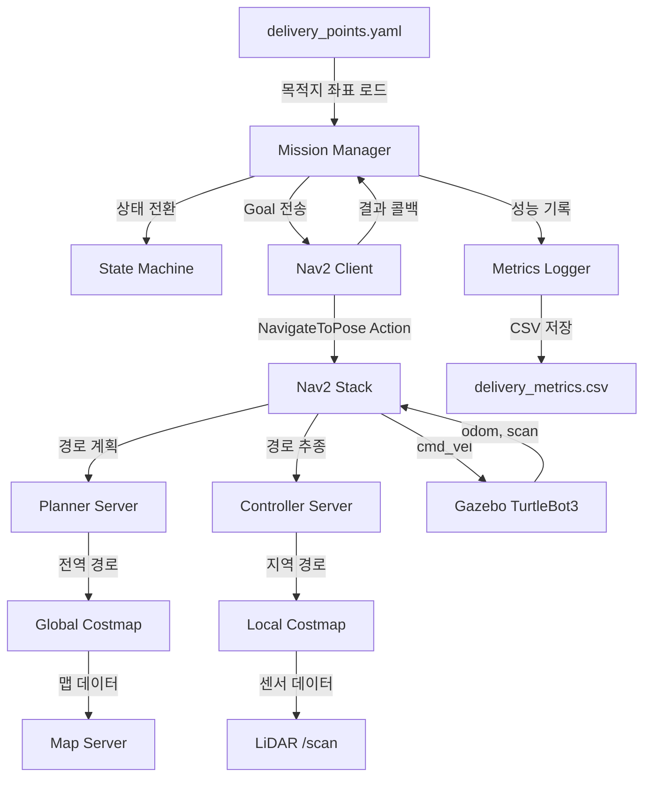
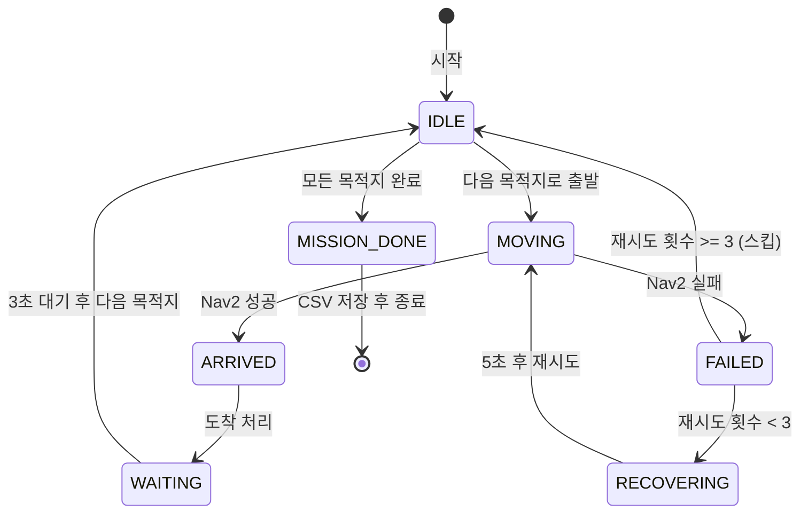

# 🤖 Delivery Mission Robot

ROS2 + Nav2 기반 자율 배달 미션 로봇 시뮬레이션

## 📌 프로젝트 개요

Gazebo 시뮬레이션 환경에서 여러 목적지를 순서대로 자동 방문하는 배달 로봇입니다.
장애물이 있으면 Nav2가 자동으로 우회 경로를 계산하고,
경로를 찾지 못할 경우 재시도 로직으로 복구합니다.

## ✨ Features

- ✅ SLAM으로 자동 지도 생성 (explore_lite 기반 Frontier Exploration)
- ✅ 다중 배달 목적지 자동 순회 (yaml 파일로 좌표 관리)
- ✅ Nav2 기반 자율 주행 및 동적 장애물 회피
- ✅ 실패 시 자동 재시도 로직 (최대 3회)
- ✅ 상태 머신 기반 미션 상태 관리
- ✅ 배달 성능 자동 측정 및 CSV 저장

## 🏗 시스템 아키텍처



## 🔄 상태 머신



## 🛠 기술 스택

- ROS2 Humble
- Nav2 (Navigation2)
- Gazebo Classic
- SLAM Toolbox / Cartographer
- Python3

## 📁 프로젝트 구조

```
delivery_robot/
├── maps/                         # SLAM으로 생성한 지도
│   ├── house_map.pgm
│   └── house_map.yaml
├── config/
│   └── delivery_points.yaml      # 배달 목적지 좌표
└── src/
    └── delivery_robot/
        ├── mission_manager.py    # 미션 전체 조율 (메인 노드)
        ├── nav2_client.py        # Nav2 액션 클라이언트
        ├── state_machine.py      # 로봇 상태 관리
        └── metrics_logger.py     # 성능 측정 및 CSV 저장
```

## 🔄 동작 흐름

```
yaml 목적지 로드 → Nav2에 Goal 전송 → 이동 중 피드백 수신
→ 도착 시 다음 목적지 → 실패 시 재시도 → 전체 완료 시 CSV 저장
```

## 📊 성능 측정 결과

| 목적지 | 결과 | 소요 시간 | 재시도 |
|--------|------|-----------|--------|
| A | 성공 | 74.5초 | 0회 |
| B | 성공 | 153.5초 | 0회 |
| C | 성공 | 84.0초 | 0회 |
| D | 성공 | 196.0초 | 0회 |

## 🚀 실행 방법

### 1. 환경 설정

```bash
export TURTLEBOT3_MODEL=burger
```

### 2. Gazebo 실행

```bash
ros2 launch turtlebot3_gazebo turtlebot3_house.launch.py
```

### 3. Nav2 실행

```bash
ros2 launch turtlebot3_navigation2 navigation2.launch.py \
    use_sim_time:=True \
    map:=$HOME/map/house_map.yaml
```

### 4. 미션 시작

```bash
ros2 run delivery_robot mission \
    --ros-args -p config_path:=$HOME/delivery_robot/config/delivery_points.yaml
```

### 5. RViz에서 2D Pose Estimate로 초기 위치 설정

## 📝 배달 목적지

| ID | 이름 | 좌표 |
|----|------|------|
| A | 1번 배달지 | (0.809, 1.984) |
| B | 2번 배달지 | (-4.320, 0.405) |
| C | 3번 배달지 | (2.987, 4.599) |
| D | 4번 배달지 | (7.440, -2.799) |

미션 순서: A → B → C → D

## 트러블 슈팅
### Nav2 Goal 전송 후 콜백 미호출
**문제**: 목적지에 도착해도 `ARRIVED` 상태로 전환되지 않고 멈춤
**원인**: `Nav2Client`가 독립 노드라서 `spin`이 안 돼 콜백이 호출되지 않음
**해결**: `Nav2Client`에서 Node 상속 제거 후 `MissionManager` 노드를 직접 받아서 액션 클라이언트 생성


## 🎥 시연 영상
[배달 미션 로봇 시연 영상](https://drive.google.com/file/d/1WyX34ntt4XfNsybfOq4yJ666OlovG3A9/view?usp=sharing)
